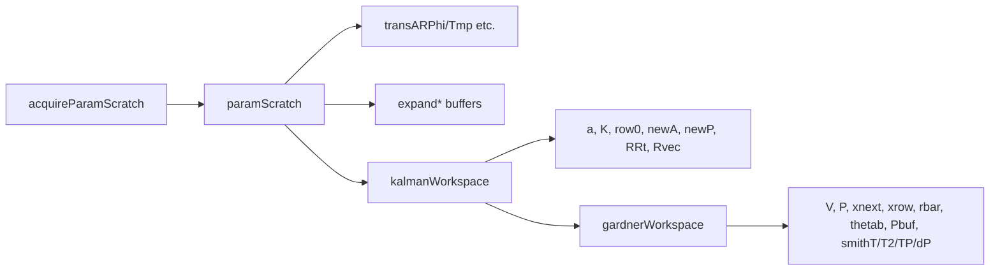

# sync.Pool layout

`paramScratchPool` (`arima/param_scratch.go`) is the central pool —
acquired once per likelihood evaluation, returned at the end. One
acquisition gives you everything for one call:

## Why one pool that owns everything

One `Get` / `Put` per likelihood call instead of five. The buffers
grow lazily to fit the largest (n, r) seen and reuse the prefix for
smaller calls. KAL-WORKSPACE eliminated the per-call Kalman allocs;
G-NEW-2 / G-NEW-3 extended the same pattern to Gardner / transparams.

## Lifetime

Per-call: `defer releaseParamScratch(s)` after `acquireParamScratch()`
in every likelihood entry point. The pool is contended only when
`parallelGradient` workers run — each worker grabs its own scratch,
so contention is minimal in practice (PG-91).
