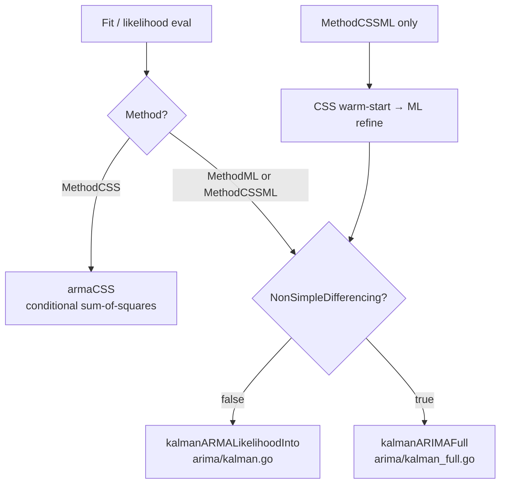

# Dispatch

| Path | File | When |
|---|---|---|
| `armaCSS` | `arima/kalman.go:armaCSS` | `Method=MethodCSS` |
| `kalmanARMALikelihoodInto` | `arima/kalman.go` | `Method=ML/CSSML` AND `NonSimpleDifferencing=false` |
| `kalmanARIMAFull` | `arima/kalman_full.go` | `Method=ML/CSSML` AND `NonSimpleDifferencing=true` |

`MethodCSSML` (default) runs CSS first to warm-start the ML pass —
gives BFGS a much better starting point on flat likelihood surfaces.

The `NonSimpleDifferencing` switch is the parity knob: see
[`../policies/parity-modes.md`](../policies/parity-modes.md).
